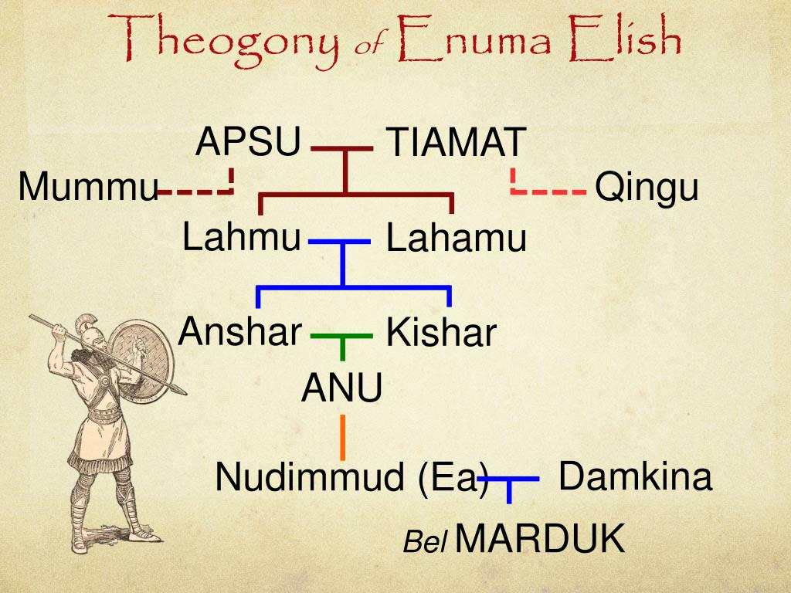
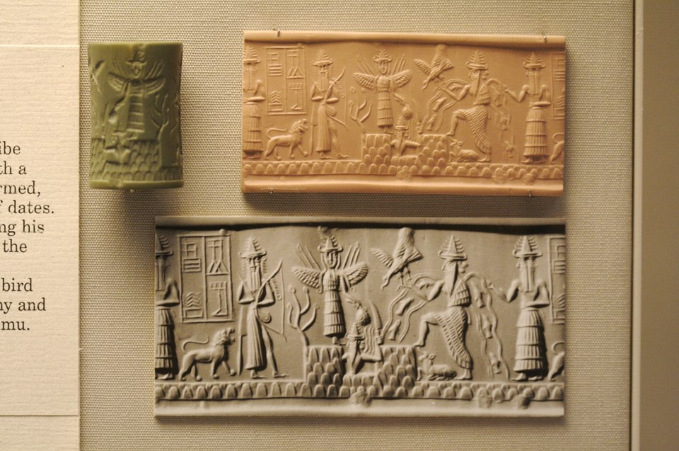
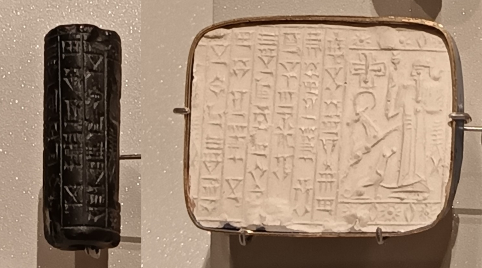
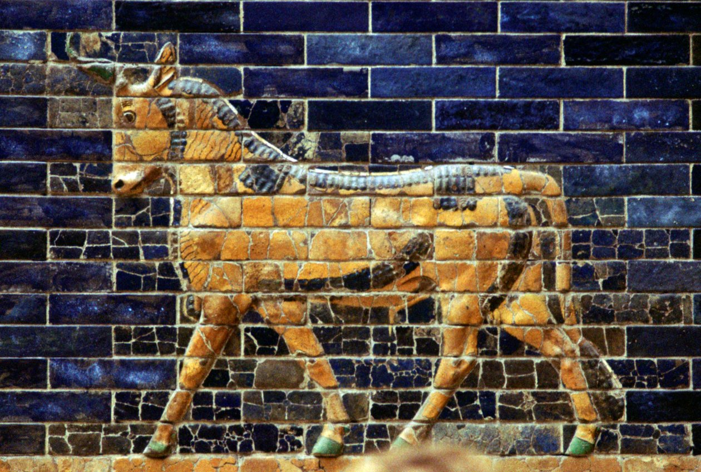
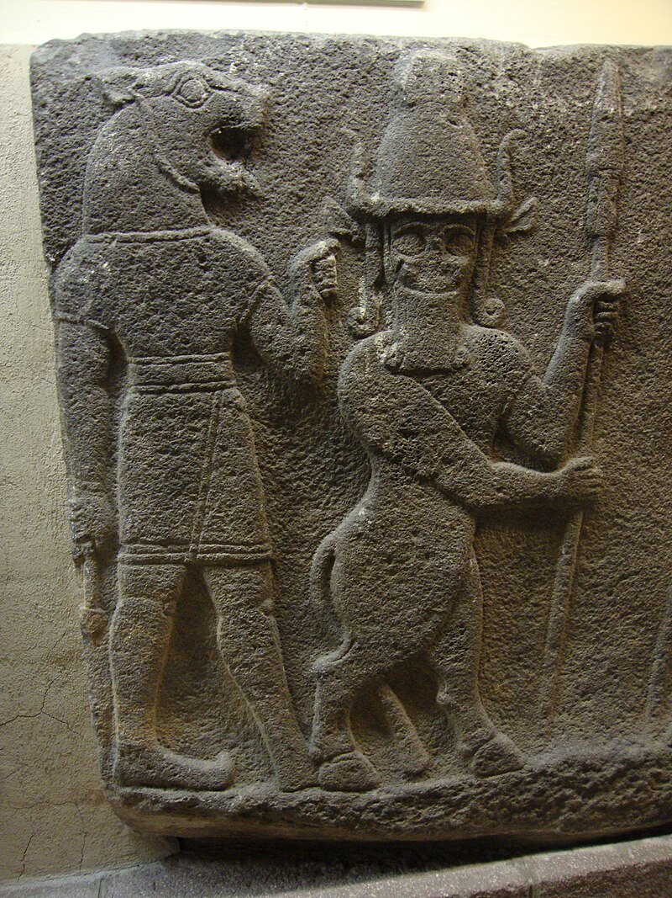
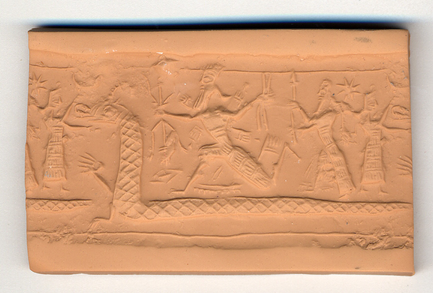
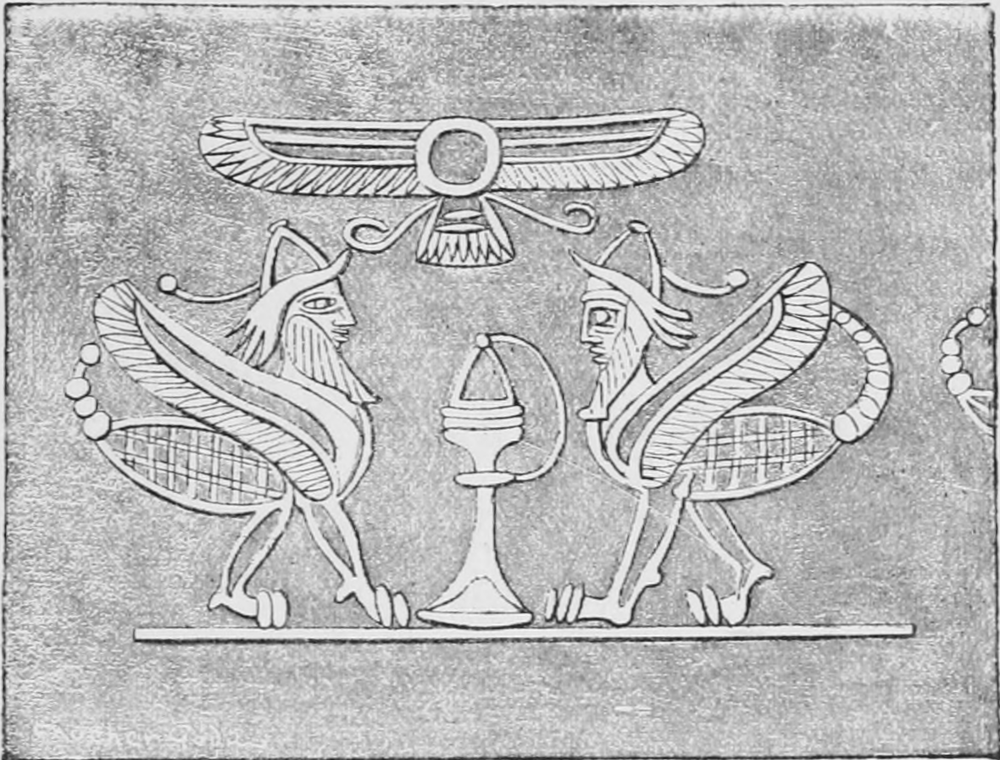
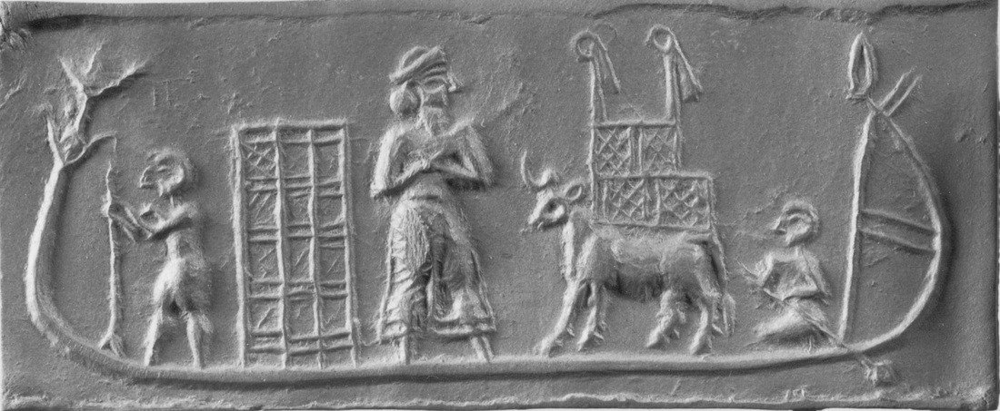
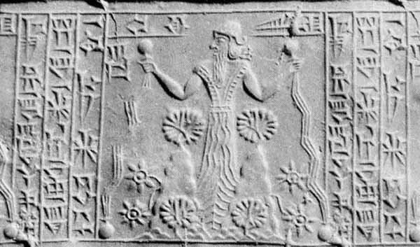

## The Babylonian Epic of Creation: Enuma Elish

---

## Enuma Elish
> 𒂊𒉡𒈠-  𒂊𒇺  𒆷   𒈾𒁍𒌋 𒊭𒈠𒈬
- 𒉺‍𒅁𒇺 𒄠𒈠𒌈  𒋗𒈠  𒆷l 𒍠𒋥

> enuma eliš lā nābu šamāmu
- šapliš ammatum šuma lā zakrat

Notes: what does mumu mean?

---

## When On High

> enuma eliš lā nābu šamāmu
- šapliš ammatum šuma lā zakrat

> When on high, the heavens had not been named
- When the earth below had not been called out by name

Notes: What is the focus? What is the beginning of the narrative? In the ancient near east they didn't think as much about the material, they were more interested in the purpose; the way the thing could be used.

---{"layout": "center"}

## First was Apsu and Tiamat

Notes: Absu and Tiamat were the first

---{"layout": "center"}

## Ea makes his dwelling

---{"layout": "columns"}

## Marduk is Born

::section

::section

> In Apsu was Marduk born
- In pure Apsu was Marduk born.

---

> Ea his father begat him,
- Damkina his mother bore him.
His figure was well developed, the glance of his eyes was dazzling,
- His growth was manly, he was might from the beginning.
Four were his eyes, four his ears,
- Flame shot forth as he moved his lips.
His four ears grew large,
- And his eyes likewise took in everything

Lambert 2013

---

## Marduk given the Four Winds

Notes: Notice the Musḫušu?

---

## The Four Winds Really Annoy Tiamat

1. The old gods are also mad they woke up from their nap
1. They show that they killed her old consort

Notes: The four winds inspire tiamat to create an army

---

## Tiamat Gathers her forces

---{"layout": "columns"}

::section

::section

---{"layout": "center"}

### Scorpion Men

---

### The Gods React to Tiamat

1. Ea over hears Qingu being elevated to consort
1. Ea is overwhelemd by Tiamat's force
1. He tells the owther gods
1. All of the other Gods are afraid
1. Even Ea is afraid

---

### Ea informs Marduk

1. Marduk is happy to meat Tiamat in Battle
1. Anshar calls the gods to assembly
1. He prepares himself for battle

---

### Marduk's Flood Weapon

---{"layout": "center"}

### Marduk Defeats Tiamat

---

### Marduk Builds the World

Notes: Modeled the world after the Apsu

---

### The Gods Praise Marduk

1. They give him the Tablet of Destinies
1. He establishes the seasons and the festivals that mark them
1. The Gods give him 50 names

---{"layout":"center"}

### Why Fifty Names?

---

### The names of Marduk

1. They are drawn from God lists
1. They are placed at the end of the tablet to show that Marduk is unquestionably the
   lord over all the gods
1. Ea gives him his own name en-kur-kur: lord of the lands

